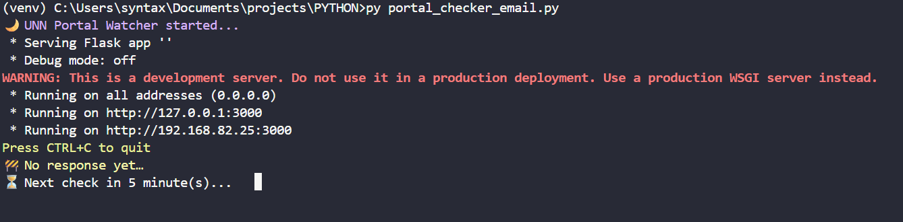

# UNN Hostel Portal Watcher

A robust, automated monitoring solution designed to track the availability of the University of Nigeria, Nsukka (UNN) hostel portal. This system continuously polls the target URL and dispatches immediate email notifications to a subscribed list of recipients once the service becomes reachable.

## 🚀 Features

- **Real-time Monitoring**: Checks the portal status every 5 minutes (configurable).
- **Smart State Tracking**: Implements state logic (`up` vs `down`) to prevent spamming. Alerts are only sent when the status changes from "down" to "up".
- **Content Verification**: Validates not just the HTTP status code (200), but also checks for specific content ("Login") to ensure the page is fully rendered.
- **Keep-Alive Server**: Includes a lightweight Flask server (`keep_alive.py`) to prevent the process from idling when hosted on platforms like Replit or Glitch.
- **Console Dashboard**: Provides a color-coded CLI output with a countdown timer for the next check.

## 🛠️ Prerequisites

- Python 3.8+
- A Gmail account (for SMTP) with an **App Password** generated.

## 📦 Installation

1. **Clone the repository**

   ```bash
   git clone https://github.com/yourusername/unn-portal-watcher.git
   cd unn-portal-watcher
   ```

2. **Install dependencies**
   ```bash
   pip install requests python-dotenv flask
   ```

## ⚙️ Configuration

This project uses environment variables to manage sensitive credentials.

1. Create a file named `.env` in the root directory.
2. Add the following variables.

### `.env` Example

```ini
# Your Gmail App Password (not your regular login password)
EMAIL_PASSWORD=xxxx xxxx xxxx xxxx

#sender email address
EMAIL_ADDRESS=myemail@gmail.com


EMAIL_PASSWORD=xxxx xxxx xxxx xxxx

# Comma-separated list of recipients
EMAIL_LIST=student1@gmail.com,student2@yahoo.com,friend@outlook.com
```

> **Note:** The sender email address is currently configured in `portal_checker_email.py`. Ensure the `EMAIL_PASSWORD` corresponds to that account.

## 🖥️ Usage

Run the main script to start the watcher:

```bash
python portal_checker_email.py
```

**Console Output:**

_local Console:_

<p align="center">
  
</p>

- 🔵 **Blue**: System startup / Portal remains up.
- 🟡 **Yellow**: Checking status / Network wait.
- 🟢 **Green**: Portal is back online (Email sent).
- 🔴 **Red**: Portal is down.

## ☁️ Deployment (Replit/Cloud)

This project is optimized for cloud environments that require a web server to stay active.

1. Upload files to your Replit container.
2. Configure your **Secrets** (Environment Variables) in the Replit dashboard with the keys defined in the Configuration section above.
3. Run the script.
4. Use a service like **UptimeRobot** to ping the web address generated by the Flask app (e.g., `https://your-repl-name.repl.co`) to keep the script running 24/7.

## 📂 Project Structure

```text
.
├── portal_checker_email.py  # Main logic, polling loop, and email trigger
├── keep_alive.py            # Flask server for background persistence
├── .env                     # Secrets (excluded from version control)
└── README.md                # Documentation
```

---

_Built for the UNN Community._
